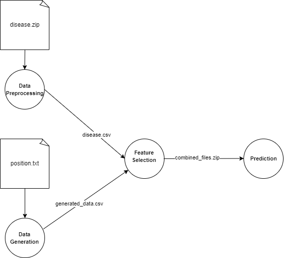

# Obesity Disease Prediction Workflow

This project implements an obesity disease prediction pipeline, running on ocean nodes, to predict and evaluate disease risk using genotype and phenotype data.

## Workflow Overview

1. **Metadata Collection**  
   Metadata is collected and prepared for further preprocessing steps. This step ensures that the data is ready for analysis.

2. **Data Preprocessing**  
   Genotype data is labeled using phenotype information. This creates a structured dataset for analysis in the subsequent steps.

3. **Data Generation**  
   Additional genotype-phenotype data is generated to enrich the dataset and improve model robustness and accuracy during training.

4. **Feature Selection**  
   Important features that have a strong relationship with obesity are selected. This step enhances both the performance and interpretability of the model.

5. **Prediction**  
   Machine learning models are used to predict obesity-related outcomes based on the selected features. Model performance is then evaluated.



## Prerequisites

Before running the workflow, ensure the following dependencies are installed:

- Python >= 3.12
- Required Python packages: (can be installed using `requirements.txt`)
  ```bash
  pip install -r requirements.txt

# Getting Started 
1. **Clone the repository**
git clone https://github.com/a2nfinance/deflow-example
cd deflow-example
2. **Run the workflow**
After cloning, you can start the workflow by following the steps below:

### Metadata Collection
```
python collection.py --output_dir <your_output_directory> --output_zip <your_output_zip_file_name>

```
### Data Preprocessing
```
python preprocessing.py --input_data <your_data_directory> --output_dir <your_output_zip_file_name>

```
### Data Generation
```
python generation.py --output_dir <your_output_zip_file_name>

```
### Feature Selection
```
python train.py --meta <your_meta_data_directory> \
                --data <your_data_directory> \
                --gen_data <your_generated_data_directory> \
                --output_dir <your_output_zip_file_name>
```
### Prediction
```
python train.py --input_data <your_data_directory> --output_dir <your_output_zip_file_name>
```
3. **Evaluation**
The results of the prediction model will be outputted in the ouput/ folder, including performance metrics such as sensitivity, accuracy, specificity, MCC, AUC.

# Directory Structure

├── data/                     # Raw and preprocessed data files       
├── src/                      # Source code for the workflow steps   
│   ├── meta_data_collection         # Collecting meta data      
│   ├── data_preprocessing         # Script for data preprocessing    
│   ├── data_generation      # Scripts for data generation      
│   ├── feature_selection  # Scripts for feature selection     
│   └── predictions  # Script for prediction  
├── README.md                 # Project description and instructions   
├── requirements.txt          # Required packages for the project
